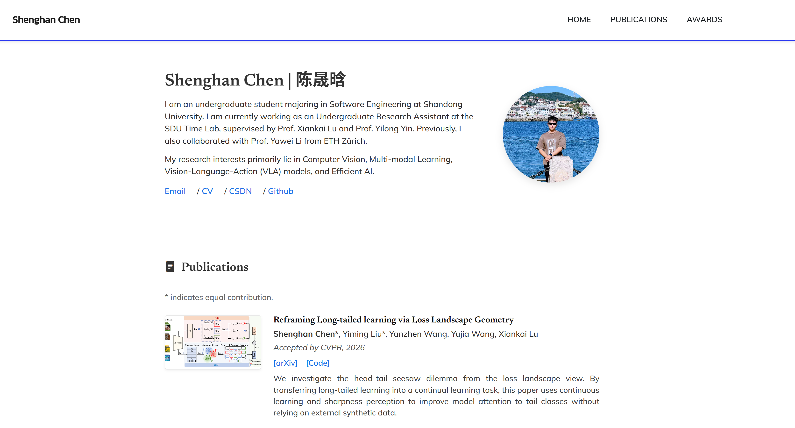

# Shenghan Chen 的个人主页 | Personal Homepage of Shenghan Chen


这是一个极简、高效、无任何冗余依赖的纯静态个人学术与求职主页。

为了追求极致的访问速度和最低的维护门槛，本项目彻底剥离了复杂的动态加载机制与 Markdown 解析引擎。所有的配置、论文列表和奖项都在一个干净的 `index.html` 文件中直接管理，真正的做到“开箱即用”。

---

## 👁️ 预览 | Preview

👉 **Live Demo:** [Shenghan-Chen's Homepage](https://chenshenghan100.github.io/ChenShengHan.github.io/#)

[](https://chenshenghan100.github.io/ChenShengHan.github.io/#)

---

## ✨ 核心特性 | Features

- ⚡ **极致轻量 (Lightning Fast)**: 零外部框架依赖，无需 Node.js、Jekyll 或 Hexo 环境，秒级加载。
- 📱 **响应式设计 (Fully Responsive)**: 完美适配 PC、平板和移动端，随时随地优雅展示你的学术成果。
- 🛠️ **零配置门槛 (Zero Config)**: 告别繁杂的 `.yml` 配置文件。想要修改任何内容？直接在 `index.html` 中 `Ctrl+F` 搜索并替换即可。
- 🔍 **SEO 友好 (SEO Friendly)**: 纯静态硬编码的 HTML 内容更容易被 Google/Bing 等搜索引擎抓取，大幅提升你的学术可见度。

---

## 📂 目录结构 | Directory Structure

本项目采用最纯粹的静态网页结构：

```text
.
├── static                  # 静态资源核心库
│   ├── assets              # 媒体资源存放处
│   │   ├── favicon.ico     # 浏览器标签页专属图标
│   │   └── img             # 个人头像、论文缩略图、展示图等
│   ├── css                 # 样式表 (包含 Bootstrap 核心与精调版式)
│   └── js                  # 交互脚本 (已极简处理，仅保留导航栏折叠等基础功能)
├── index.html              # 唯一且强大的核心网页文件 (所有的文字都在这里改！)
├── Preview.png             # 网站预览截图
├── README.md               # 项目说明文档
└── LICENSE                 # 开源协议
```

---

## 🚀 如何使用 | Getting Started

1. **Fork 本仓库**：将代码 Fork 到你的个人账号下。
2. **修改内容**：打开 `index.html`，把里面的名字、简介、论文和奖项替换成你自己的。
3. **替换图片**：将你的头像、论文缩略图放入 `static/assets/img/`，并在 HTML 中更新对应的文件名。
4. **自动部署**：推送到 `main` 分支后，开启 GitHub Pages 即可获得你的专属链接。

---

## 🙏 致谢 | Acknowledgements

本主页的排版与设计脱胎于众多优秀的开源学术主页模板。站在巨人的肩膀上，才有了这个极简版本的诞生。在此向以下开源项目与作者表示最诚挚的感谢：

* **[Jon Barron](https://jonbarron.info/)**: 感谢计算机视觉领域大神 Jon Barron 提供的极为经典的极简学术主页排版思路，本模板的核心视觉风格深受其启发。
* **[Yixin0313](https://github.com/Yixin0313/personal-homepage-template) & [Sen Li](https://github.com/senli1073/senli1073.github.io)**: 感谢前期基于这些优秀开源项目进行的探索。为了追求更极致的性能与易用性，我在其基础架构上进行了彻底的“去动态化”重构，剥离了繁杂的配置项，最终呈现出目前这个干净的单文件版本。

---

## 📜 开源协议 | License

本项目基于 **MIT License** 开源。

你可以自由地克隆、修改、甚至用于商业用途。如果你觉得这个极简模板对你的学术生涯或求职有所帮助，欢迎在右上角点亮一个 ⭐ **Star**！

Copyright (c) 2026 Shenghan Chen. All Rights Reserved.